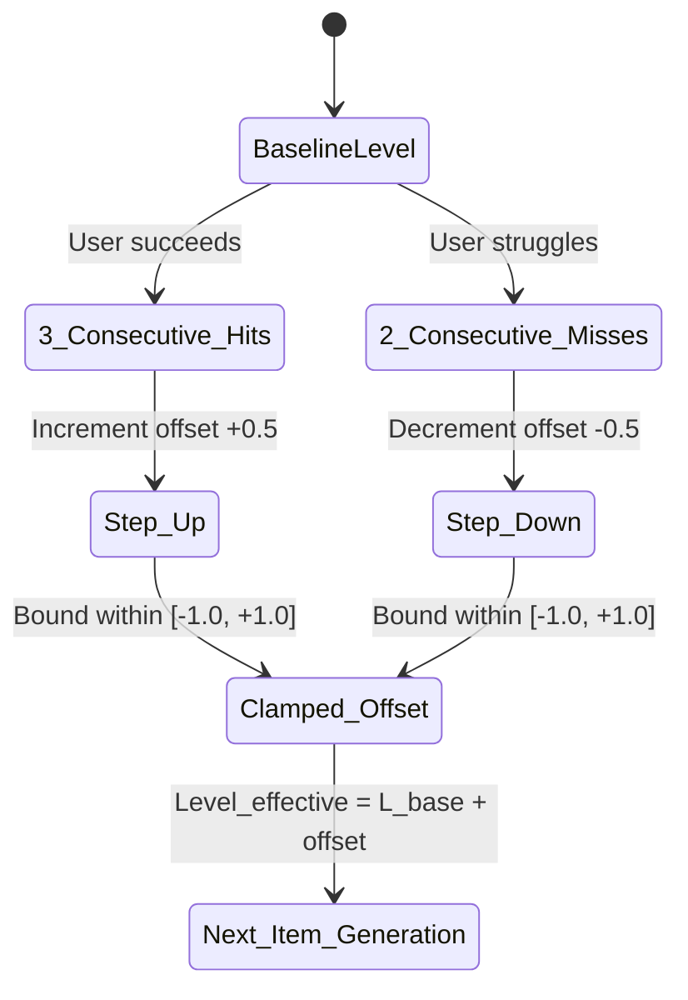
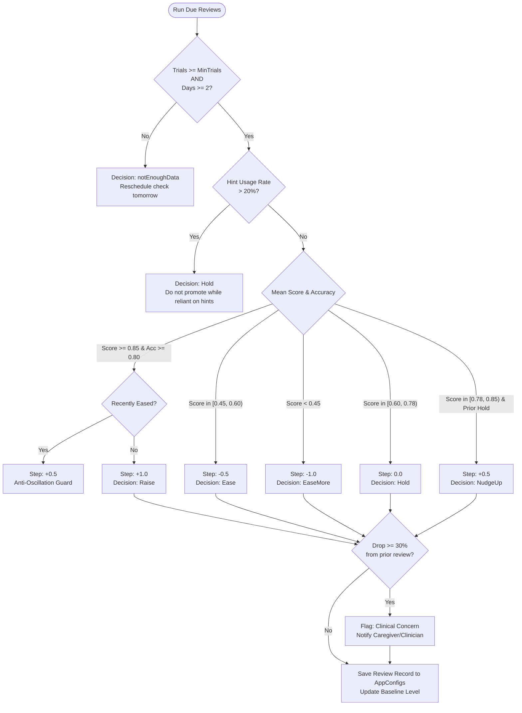
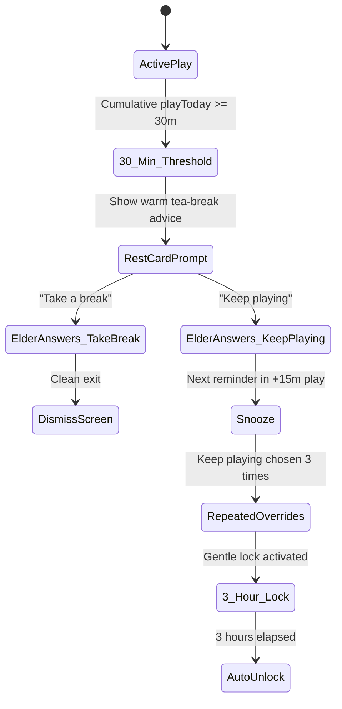

# Adaptive Progression & Cognitive Fatigue Management Engine
## Developer Architecture & Implementation Guide

> **Target Audience**: Software engineers, game designers, and system architects building adaptive learning, cognitive rehabilitation, elder-care, or therapeutic game platforms.
>
> **Core Objective**: Provide an automated, mathematically rigorous, self-tuning progression system that adapts to user ability in real time without causing anxiety, frustration, cognitive fatigue, or perseveration.

---

## 1. Architectural Philosophy & Core Principles

Traditional game progression systems (static levels, 3-star ratings, "Game Over" screens, and hard failure gates) are fundamentally unsuitable for cognitive healthcare, rehabilitation, and elder care. Patients experiencing mild cognitive impairment (MCI), dementia, or post-stroke recovery experience high variability in daily cognitive energy. An inflexible system causes frustration, anxiety, and catastrophic abandonment.

### The Five Non-Negotiable Principles

1. **Zero Negative Feedback**:
   - The system never says "Wrong", "Failed", "Defeat", or "Level Dropped".
   - No red error banners, buzzer sound effects, or countdown stress timers.
   - Incorrect answers are met with neutral auditory feedback and gentle resets. Difficulty eases **silently** in the background.

2. **Dual-Loop Adaptation**:
   - **Inner Loop (Micro)**: Immediate within-session responsiveness via a bounded **Staircase Method** to handle transient daily fluctuations (e.g., fatigue, poor sleep, medication timing).
   - **Outer Loop (Macro)**: Robust, low-frequency **4-Day Review** evaluating cumulative multi-day trends to make baseline promotions and demotions.

3. **Self-Generating Parametric Levels (No Static Tables)**:
   - Levels are not hardcoded look-up tables (e.g., Level 1 = 3 items, Level 2 = 4 items).
   - Levels are generated continuously from **parametric mathematical curves** with defined humane limits. The engine can generate thousands of intermediate levels indefinitely without code changes.

4. **Local-First & Offline-First Integrity**:
   - The device's local database (SQLite/Drift) is the **single source of truth**.
   - Level evaluations, session runner decisions, and item generation occur 100% on-device with zero network latency. Cloud sync is asynchronous and read-back decoupled.

5. **Holistic Cognitive Well-Being**:
   - **Anti-Perseveration**: Detects when a patient fixates on a single familiar game and nudges them towards under-exercised cognitive domains.
   - **Fatigue Protection**: Detects cumulative screen time and presents warm, respectful tea-break recommendations without punitive lockouts.

---

## 2. Mathematical Foundations: The Unified Level Scale

Cognitive ability and item difficulty are modeled on an **Item Response Theory (IRT)** / logit scale ($\theta, d$). However, clinicians, caregivers, and game designers require intuitive, human-readable numbers ($L \ge 1.0$).

### The Bijective Level-to-Difficulty Transformation

The engine defines an exact, continuous linear bijection between human-readable **Level ($L$)** and psychometric **Difficulty ($d$)**:

$$\boxed{d = \frac{L - 5}{2}} \quad \Longleftrightarrow \quad \boxed{L = 5 + 2d}$$

```
Level (L)          Difficulty (d)        Psychometric Interpretation
-------------------------------------------------------------------------
L = 1.0    <--->   d = -2.0              Extremely gentle / Baseline intro
L = 3.0    <--->   d = -1.0              Mild challenge / Novice
L = 5.0    <--->   d =  0.0              Median / Standard adult baseline
L = 7.0    <--->   d = +1.0              Competent / Enhanced challenge
L = 9.0    <--->   d = +2.0              Advanced cognitive demand
L = 13.0   <--->   d = +4.0              Expert / High-capacity boundary
```

### Key Scale Properties:
- **Quantization**: Stored baseline levels are quantized to steps of $0.5$ ($1.0, 1.5, 2.0, 2.5, \dots$).
- **Minimum Floor**: $L \ge 1.0$ (ensures items never underflow into degenerate negative configurations).
- **Rasch Probability Model Connection**: Under a standard logistic model, the probability of a correct response is:
  $$P(\text{Correct} \mid \theta, d) = \frac{1}{1 + e^{-(\theta - d)}}$$
  When the user's estimated ability $\theta$ equals the item difficulty $d$, $P(\text{Correct}) = 0.50$. Setting target difficulty slightly below estimated ability ($\theta - 0.5$) maintains a therapeutic success rate of $\approx 75\% - 85\%$, fostering confidence and adherence.

---

## 3. Parametric Game Profiles & Difficulty Axes

Instead of storing pre-built levels in JSON or databases, each game is defined by a **`LevelProfile`** composed of independent **`DifficultyAxis`** objects.

### 3.1 Anatomy of a `DifficultyAxis`

A `DifficultyAxis` governs one physical or cognitive dimension of a game (e.g., grid size, number of items, distractor count, display duration, retention delay).

```dart
class DifficultyAxis {
  final String name;        // e.g. "targetCount", "studySeconds", "distractorRatio"
  final double start;       // Baseline value at and below startLevel
  final double perLevel;    // Rate of change per +1.0 level (positive or negative)
  final double limit;       // Humane upper/lower bound that must never be crossed
  final double startLevel;  // Level at which this axis starts moving (default: 1.0)
  final AxisRounding rounding; // none, floor, round
}
```

### 3.2 Evaluation Formula

For any level $L$, the value of an axis is calculated deterministically:

$$V(L) = \begin{cases} 
\text{start}, & \text{if } L \le \text{startLevel} \\
\min\big(\text{start} + \text{perLevel} \times (L - \text{startLevel}), \, \text{limit}\big), & \text{if } \text{perLevel} > 0 \\
\max\big(\text{start} + \text{perLevel} \times (L - \text{startLevel}), \, \text{limit}\big), & \text{if } \text{perLevel} < 0
\end{cases}$$

Followed by the configured rounding mode:
- **`AxisRounding.floor`**: For discrete counts (e.g., item count, stone count).
- **`AxisRounding.round`**: For nearest integer metrics (e.g., sequence span).
- **`AxisRounding.none`**: For continuous parameters (e.g., speed, seconds, probability).

### 3.3 Saturation Level & The Humane Plateau

Every axis reaches a point where further increases would be biologically or cognitively unreasonable (e.g., asking a dementia patient to memorize 25 objects in 3 seconds).

- **Axis Saturation Level**: The exact level where an individual axis hits its limit:
  $$L_{\text{sat}} = \text{startLevel} + \frac{|\text{limit} - \text{start}|}{|\text{perLevel}|}$$
- **Profile Plateau Level**: The level at which **all** axes of a game have saturated:
  $$L_{\text{plateau}} = \max_{i} (L_{\text{sat}, i})$$
- **Soft Plateau Headroom**: The engine allows the stored level to climb up to $L_{\text{plateau}} + 1.0$ (plateau headroom). Beyond that, the game is recognized as being at its humane ceiling, and further promotion is capped while tracking plateau status for clinicians.

### 3.4 Concrete Examples Across Cognitive Domains

```
+-------------------+----------------------+-------+----------+-------+------------+----------+
| Game / Domain     | Axis Name            | Start | PerLevel | Limit | StartLevel | Rounding |
+-------------------+----------------------+-------+----------+-------+------------+----------+
| Market Basket     | targetCount          | 2.0   | 0.40     | 6.0   | 1.0        | floor    |
| (Memory)          | poolSize             | 4.0   | 0.60     | 12.0  | 1.0        | floor    |
|                   | delaySeconds         | 0.0   | 0.75     | 5.0   | 3.0        | round    |
+-------------------+----------------------+-------+----------+-------+------------+----------+
| Trace the Path    | nodeCount            | 3.0   | 0.70     | 8.0   | 1.0        | floor    |
| (Visuospatial)    | decoyCount           | 0.0   | 0.40     | 3.0   | 3.0        | floor    |
+-------------------+----------------------+-------+----------+-------+------------+----------+
| Sort the Harvest  | categoryCount        | 2.0   | 0.25     | 4.0   | 1.0        | floor    |
| (Executive)       | distractorRatio      | 0.0   | 0.08     | 0.4   | 2.0        | none     |
+-------------------+----------------------+-------+----------+-------+------------+----------+
| Lamps Festival    | sequenceSpan         | 2.0   | 0.40     | 6.0   | 1.0        | floor    |
| (Working Memory)  | flashDurationMs      | 800.0 | -50.0    | 400.0 | 2.0        | round    |
+-------------------+----------------------+-------+----------+-------+------------+----------+
| Sounds of Home    | targetRatio          | 0.60  | -0.04    | 0.30  | 1.0        | none     |
| (Attention)       | interStimulusMs      | 2200  | -150.0   | 1100  | 1.5        | round    |
+-------------------+----------------------+-------+----------+-------+------------+----------+
```

---

## 4. The Inner Loop: Real-Time In-Session Staircase Method

Human cognitive performance fluctuates naturally throughout the day due to circadian rhythms, medication timing, anxiety, or fatigue. If an elder is having an off-day, locking them into a high baseline level induces distress.

### 4.1 The Staircase Algorithm

The `SessionRunner` wraps game execution with an in-session micro-adjuster:



1. **Upward Step Condition**:
   - Trigger: **3 consecutive correct hits** ($+0.5$ level).
   - Rationale: High specificity ensures that lucky guesses don't prematurely elevate difficulty.
2. **Downward Step Condition**:
   - Trigger: **2 consecutive misses / timeouts** ($-0.5$ level).
   - Rationale: Fast relief prevents agitation and negative emotional valence.
3. **Offset Clamping**:
   $$\text{offset} \in [-1.0, \, +1.0]$$
   The staircase is strictly bounded to $\pm 1.0$ level units. This prevents an ephemeral bad streak from destroying the user's evaluated baseline, and prevents an lucky run from escalating beyond safe bounds.
4. **Ephemerality**:
   - When the session ends, the in-session offset is **discarded**.
   - The stored persistent level is unaffected by the staircase. Permanent level adjustments belong exclusively to the 4-Day Review.

---

## 5. Partial-Credit Scoring Engine

Simple binary scoring (`correct ? 1.0 : 0.0`) is inadequate for cognitive analytics. A patient who successfully recalls 3 out of 4 items has demonstrated substantial memory retention; scoring this trial as `0.0` loses critical clinical data.

Every trial emits telemetry containing structured `metrics` and `trialContext`. The `TrialScoring` engine computes a continuous score $S \in [0.0, 1.0]$:

### Game-Specific Scoring Formulas

| Game Archetype | Scoring Formula | Clinical Rationale |
|---|---|---|
| **Multi-Item Recall** (e.g., Market Basket) | $S = \max\left(0, 1 - \frac{\text{missed} + \text{intrusions}}{\text{targets}}\right)$ | Rewards correct items while penalizing confabulation (intrusions). |
| **Path Sequencing** (e.g., Trace the Path) | $S = \max\left(0, 1 - \frac{\text{errors}}{\text{nodeCount}}\right)$ | Differentiates a minor tremor slip from total disorientation. |
| **Chronological Ordering** (e.g., My Day) | $S = \max\left(0, 1 - \frac{\text{misplaced}}{\text{totalEvents}}\right)$ | Measures distance from correct chronological sequence. |
| **Span Recall** (e.g., Lamps Festival) | $S = \frac{\text{spanAchieved}}{\text{targetSpan}}$ | Partial credit for recalling the initial prefix of a sequence. |
| **Categorical Fluency** (e.g., Name the Harvest) | $S = \min\left(1.0, \frac{\text{validNamed}}{\text{expectedCount}}\right)$ | Lexical access score against age/difficulty-normed expectation. |
| **Continuous Vigilance** (e.g., Sounds of Home) | $S = \max\left(0, \text{HitRate} - 0.5 \times \text{FalseAlarmRate}\right)$ | Signal Detection Theory ($d'$) penalizing impulsive tapping. |

---

## 6. The Outer Loop: 4-Day Macro Review Engine

Every **4 calendar days**, the `ProgressionService` initiates an automated background review for each game.



### 6.1 Review Decision Policy Table

| Decision | Condition | Level Delta ($\Delta L$) | Goal |
|---|---|---|---|
| **Raise** | $\text{Score} \ge 0.85 \land \text{Accuracy} \ge 0.80 \land \text{HintRate} \le 0.20$ | $+1.0$ (or $+0.5$ if recently eased) | Promote thriving user. |
| **Nudge Up** | $\text{Score} \ge 0.78 \land \text{PriorDecision} \in \{\text{Hold, NudgeUp}\} \land \text{HintRate} \le 0.20$ | $+0.5$ | Incremental bump for solid performer. |
| **Hold** | $\text{Score} \in [0.60, 0.78)$ OR $\text{HintRate} > 0.20$ | $0.0$ | Sweet spot of engagement; maintain level. |
| **Ease** | $\text{Score} \in [0.45, 0.60)$ | $-0.5$ | Relieve emergent cognitive strain gently. |
| **Ease More** | $\text{Score} < 0.45$ | $-1.0$ | Decisive reduction to restore confidence. |
| **Not Enough Data**| $\text{Trials} < 8$ (or $<3$ for long tasks) OR $\text{ActiveDays} < 2$ | $0.0$ | Insufficient evidence; re-check tomorrow. |
| **Returning** | Inactive for $\ge 14$ days | $-1.0$ | Soft re-entry after illness or absence. |

### 6.2 Anti-Oscillation Safeguard
If a user was demoted (`ease` or `easeMore`) in either of their last two reviews, a sudden promotion is gated:
1. The user must qualify for a raise in **two consecutive review cycles**.
2. When promoted, the step size is throttled to $+0.5$ instead of $+1.0$.
*Clinical Rationale*: Prevents frustrating "ping-ponging" between levels where an elder is promoted on Monday, struggles on Tuesday, and is demoted on Friday.

### 6.3 Clinical Concern Detection
If a patient's mean performance score drops by $\ge 30\%$ ($\text{Score}_{\text{prev}} - \text{Score}_{\text{curr}} \ge 0.30$) between consecutive valid reviews:
- The system sets `concern: true` on the `ReviewRecord`.
- The level is eased as usual, but the flag is exposed on the hidden clinical diagnostics screen.
- *Clinical Value*: In dementia care, an acute $30\%$ drop over 4 days is rarely natural disease progression; it is frequently an indicator of **delirium, urinary tract infection (UTI), stroke, or adverse medication interaction**.

---

## 7. Fatigue & Fixation Management (Player Well-Being)

Cognitive rehabilitation apps must prevent **cognitive exhaustion** and **perseveration** (repetitive fixation on a single task).

### 7.1 The Daily Rest Card Engine



1. **Session Contribution Cap**:
   Each session's contribution to `playSecondsToday` is strictly capped at $8$ minutes (`maxCountedSessionSeconds = 480s`). If a tablet is left on or the app crashes mid-session, corrupted timers cannot inflate the daily total.
2. **Threshold & Repetition**:
   - Initial prompt triggers at **30 minutes** of cumulative play in a single local day.
   - If the user taps "Keep playing", the reminder resets for **+15 minutes** of additional play.
3. **Gentle Eye Break Lock**:
   - If the user overrides the reminder **3 consecutive times** (`maxKeepPlayingCount = 3`), games lock for **3 hours** (`gameLockHours = 3`).
   - The lock is framed with empathy: *"You have played wonderfully today! Time to rest your eyes and have some tea. Games will return soon."* Zero countdown timers or padlock icons.

### 7.2 The Variety Nudge Engine

Patients with frontal or temporal lobe impairment frequently perseverate—playing the same easy, familiar game (e.g., tapping pictures) dozens of times while avoiding unfamiliar domains (e.g., executive planning or calculation).

1. **Detection Rule**:
   A game triggers a variety nudge if:
   - Played $\ge 6$ times in the last $1 - 3$ days (`nudgeRepeatPlays = 6`).
   - Accounts for $\ge 60\%$ of all sessions played in that window (`nudgeShareOfPlays = 0.6`).
2. **Target Recommendation**:
   The engine scans the remaining 4 cognitive domains (Memory, Visuospatial, Executive, Language, Attention) and selects the domain with the **oldest last-played timestamp**.
3. **Warm UI Presentation**:
   - A soft banner appears on the game select screen: *"You're doing great at Market Basket! How about trying Trace the Path today?"*
   - A subtle "Try today" medallion adorns the recommended game tile.
   - If dismissed twice, nudges snooze automatically for 2 days.

---

## 8. Clean Architecture & Code Blueprint

The entire progression system is organized under a standalone, modular directory (`lib/core/progression/`) adhering to pure separation of concerns.

```
lib/core/progression/
├── progression_config.dart      # Single source of truth for all thresholds
├── level_scale.dart             # Pure bijection (Level <-> Difficulty)
├── difficulty_axis.dart         # DifficultyAxis, LevelProfile, saturation formulas
├── game_level_profiles.dart     # Declarative profiles for all game archetypes
├── trial_scoring.dart           # Partial credit scoring formulas
├── performance_report.dart      # 4-day window trial aggregator
├── progression_policy.dart      # Pure decision rules (Raise/Hold/Ease/Concern)
├── play_policy.dart             # Pure rules for Rest Card and Variety Nudge
├── progression_state.dart       # Immutable data models & JSON serialization
├── progression_repo.dart        # Persistence adapter (Key-Value local DB)
├── difficulty_source.dart       # Pluggable session difficulty provider
└── progression_service.dart     # Unified facade wiring database, runner & UI
```

### 8.1 Zero-Migration Persistence Pattern

To avoid complex schema migrations in production, progression state is stored as versioned JSON blobs inside the app's generic key-value table (`AppConfigs`):

| Key Pattern | Encapsulated Model | Purpose |
|---|---|---|
| `progression.v1.game.<gameId>` | `GameProgress` | Baseline level, review history, anti-oscillation counters |
| `progression.v1.rest` | `RestState` | Cumulative daily seconds, snooze counters, lock timestamps |
| `progression.v1.nudge` | `NudgeState` | Dismissal counts, snooze timestamps, last target game |
| `progression.v1.settings` | `Map<String, dynamic>` | Optional clinical overrides for review windows or rest limits |

---

## 9. Developer Integration & Checklist

When integrating this architecture into your own Flutter or cross-platform application, follow this systematic integration sequence:

### Step 1: Define Your Game Catalog & Cognitive Domains
Map each game in your application to a primary cognitive domain (e.g., Memory, Executive, Attention).

### Step 2: Establish Your Difficulty Axes
For every game, list its modifiable difficulty parameters. For each parameter, determine:
- What is the gentlest possible starting value?
- At what level should it start increasing?
- What is the maximum humane limit beyond which the task becomes unfair or unplayable?

### Step 3: Implement Partial Credit Scoring
Ensure your game widgets emit structured telemetry upon trial completion (targets, misses, errors, response latencies, hints taken) rather than a simple boolean flag.

### Step 4: Wire the In-Session Staircase to Item Generation
Pass `DifficultySource` into your session runner. Ensure your game items are generated using:
```dart
final effectiveLevel = difficultySource.currentDifficulty(gameId);
final params = profile.paramsAt(effectiveLevel);
final item = game.generateWithParams(params);
```

### Step 5: Schedule the 4-Day Background Review
On app launch or home screen entry, execute a non-blocking background check:
```dart
unawaited(ProgressionService.instance.runDueReviews());
```

### Step 6: Verify with Automated Tests
Ensure your test suite covers:
1. **Mathematical Monotonicity**: Ensure no axis value ever violates its `limit` or oscillates backwards across $L \in [1.0, 20.0]$.
2. **Review Transitions**: Test synthetic 4-day timelines verifying promotion, demotion, anti-oscillation dampening, and hint rate penalties.
3. **Rest Card Non-Blocking**: Verify the rest card triggers accurately at 30 minutes of cumulative play without ever crashing or locking out accidental sessions.

---

## 10. Summary Reference Table

```
+------------------------------------+---------------------------------------------------------------+
| System Component                   | Specification / Governing Rule                                |
+------------------------------------+---------------------------------------------------------------+
| Level-Difficulty Bijection         | d = (L - 5) / 2  <===>  L = 5 + 2d                            |
| Quantization Unit                  | 0.5 level increments (Minimum L = 1.0)                        |
| In-Session Staircase               | +0.5 on 3 consecutive hits, -0.5 on 2 consecutive misses       |
| Staircase Bound                    | Clamped to +/- 1.0 level offset relative to session baseline  |
| Review Window                      | 4 calendar days (Requires >= 8 trials, >= 2 distinct days)   |
| Promotion Threshold (Raise)        | Mean Score >= 0.85 AND Accuracy >= 0.80 AND Hint Rate <= 20% |
| Promotion Throttling               | Raises capped at +0.5 if eased within last 2 review cycles   |
| Clinical Concern Alert             | Performance drop >= 30% between consecutive reviews          |
| Inactivity Ease                    | -1.0 level drop after >= 14 days without play                 |
| Daily Rest Card Threshold          | 30 minutes cumulative play (capped at 8 min/session)          |
| Rest Reminder Repeat               | 15 minutes after "Keep playing" selection                     |
| Variety Nudge Trigger              | >= 6 plays in 1-3 days AND >= 60% share of total play         |
+------------------------------------+---------------------------------------------------------------+
```
